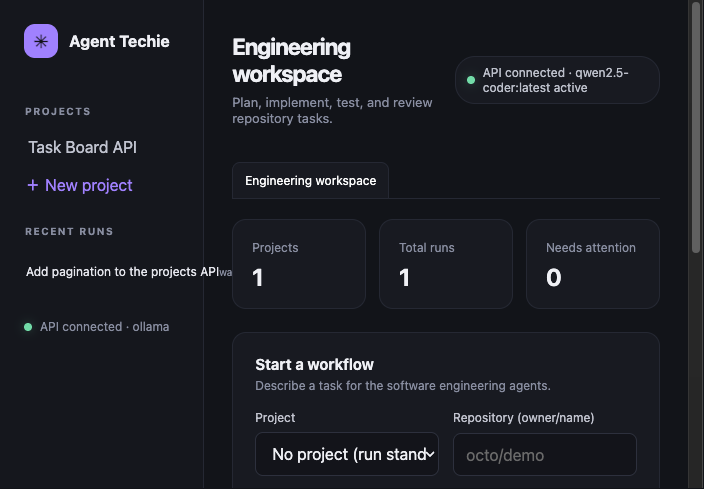
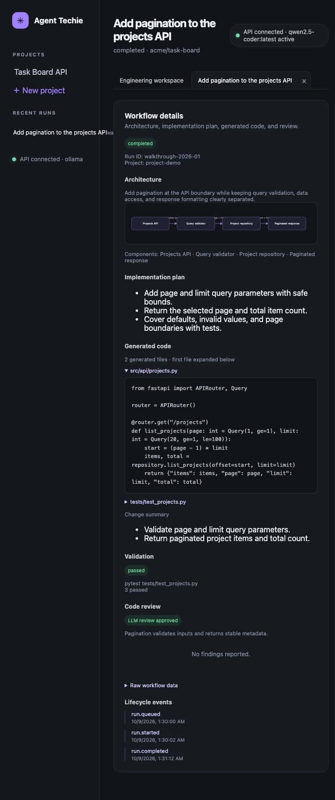

# Agent Techie

Agent Techie is a multi-agent software-engineering workflow app. Describe a task
and provide a repository identifier (`owner/name`) to get structured requirements,
an architecture proposal, proposed file contents, a validation report, and a code
review. The dashboard and REST API show each run's progress and results.

The default model provider is a local Ollama server, configured to use
`qwen2.5-coder`. OpenAI, Gemini, and Anthropic are also supported. Agent Techie
does not clone or read the named repository, write generated files into it, or
execute its test commands: code and review are proposals, and validation is a
deterministic dry run.

## Features

- **In-app workflow tabs:** keep the engineering workspace and each opened
  workflow in separate tabs within the app.
- **Workflow dashboard:** create projects, submit tasks, monitor run status,
  follow lifecycle events, and review runs awaiting human approval.
- **Workflow stages:** requirements → architecture → code proposal → dry-run
  validation → review, with supervisor routing between stages.
- **Architecture and code view:** inspect the proposed architecture diagram,
  implementation plan, generated file contents, validation report, and review
  findings in a workflow tab.
- **REST API:** manage projects, submit tasks, retrieve run results and events,
  and approve or deny runs that are paused for approval.
- **Optional workspace helpers:** root-constrained workspace file and command
  utilities are available in the codebase, but are not automatically invoked by
  the current workflow.

## App walkthrough

The workspace is the landing view. It summarizes projects and runs and provides
the form for starting a workflow. Select a project or enter a repository name,
describe the task, and choose whether to include a code proposal/review or pause
for approval.



Select a run from the status list or recent runs to open it in its own in-app
tab. Switch between that tab and the workspace using the tab bar. The workflow
view shows the result from requirements and architecture through the proposed
code, dry-run validation, review, and lifecycle events.



These screenshots use illustrative sample data; the shown task, generated code,
validation result, and review are not from a live repository run.

## Requirements

- Python 3.11 or newer for a local installation.
- Docker and the Docker Compose plugin for the containerized installation.
- For local inference, [Ollama](https://ollama.com/) and a model downloaded to
  that Ollama instance. For hosted inference, an API key for the selected
  provider.

## Run locally

```bash
git clone https://github.com/rohan9521/Agent-Techie.git
cd Agent-Techie
python -m venv .venv
source .venv/bin/activate
python -m pip install -e '.[dev]'
cp .env.example .env
```

Start Ollama if it is not already running, and download the default model:

```bash
ollama serve
ollama pull qwen2.5-coder
```

Start the application:

```bash
uvicorn agent_techie.main:app --reload
```

Open the dashboard at **http://127.0.0.1:8000/**. The interactive API
documentation is at **http://127.0.0.1:8000/docs**, the alternative ReDoc page
is **http://127.0.0.1:8000/redoc**, and the health check is
**http://127.0.0.1:8000/health**.

The frontend is served by FastAPI; it does not need a separate Node
installation or development server.

## Run with Docker Compose

Create or update `.env` and choose a provider as described in
[Configuration](#configuration). Then run:

```bash
docker compose up --build
```

The dashboard and API are available at **http://localhost:8000/** and
**http://localhost:8000/docs**. When Ollama runs on the host and the app runs in
Compose, the default `OLLAMA_DOCKER_BASE_URL` is
`http://host.docker.internal:11434`. Change it if Ollama is reachable at a
different address. The selected model must already be installed in Ollama.

Compose also starts PostgreSQL and Redis, but the current app composition uses
in-memory persistence; starting those services does not make runs durable.
Compose's bundled database credentials are for local development, not a
production deployment.

Stop the services with `docker compose down`. This preserves named volumes;
`docker compose down -v` removes them.

## Configuration

The application reads environment variables and values from `.env`. See
[`.env.example`](.env.example) for a complete template.

| Variable | Default | Purpose |
| --- | --- | --- |
| `ENVIRONMENT` | `development` | Runtime environment label. |
| `API_PREFIX` | `/api` | Prefix for REST API routes. |
| `LOG_LEVEL` | `INFO` | Logging verbosity. |
| `LLM_PROVIDER` | `ollama` | Choose `ollama`, `openai`, `gemini`, or `anthropic`; use `disabled` for deterministic analysis without LLM calls. |
| `MODEL_NAME` | `qwen2.5-coder` | Model name for the selected provider. |
| `OLLAMA_BASE_URL` | `http://localhost:11434` | Ollama URL when running the app directly on the host. |
| `OLLAMA_DOCKER_BASE_URL` | `http://host.docker.internal:11434` | Ollama URL passed to the app container by Compose. |
| `OPENAI_API_KEY` | unset | Required when `LLM_PROVIDER=openai`. |
| `GEMINI_API_KEY` | unset | Required when `LLM_PROVIDER=gemini`. |
| `ANTHROPIC_API_KEY` | unset | Required when `LLM_PROVIDER=anthropic`. |
| `WORKSPACE_ROOT` | `.` | Root boundary for optional workspace helpers; the workflow does not automatically use them. |
| `MAX_WORKFLOW_ITERATIONS` | `20` | Maximum supervisor routing iterations. |
| `PERSISTENCE_BACKEND` | `memory` | Persistence setting; the current app composition uses in-memory storage. |
| `DATABASE_URL` | unset | Database adapter configuration; not used for persistence by the current app composition. |
| `REDIS_URL` | unset | Redis adapter configuration; not used for persistence by the current app composition. |
| `LANGSMITH_TRACING` | `false` | Enable optional LangSmith-compatible tracing. |
| `LANGSMITH_ENDPOINT` | `https://api.smith.langchain.com` | Tracing endpoint. |
| `LANGSMITH_API_KEY` | unset | Tracing credential. |
| `LANGSMITH_PROJECT` | `agent-techie` | Tracing project name. |
| `GITHUB_TOKEN` | unset | Optional GitHub credential; the current workflow does not fetch repository contents. |

### Use local Qwen with Ollama

Install and start [Ollama](https://ollama.com/), then pull a model:

```bash
ollama pull qwen2.5-coder
```

Use this configuration for a host installation:

```dotenv
LLM_PROVIDER=ollama
MODEL_NAME=qwen2.5-coder
OLLAMA_BASE_URL=http://localhost:11434
```

For Compose, set `OLLAMA_DOCKER_BASE_URL` to the address reachable from the
container. The default is suitable when Ollama is running on the Docker host on
macOS or Windows. Linux users may need to configure a host-gateway address or
place Ollama and Agent Techie on the same Docker network.

### Use a hosted provider

Set the provider, its model, and the corresponding API key in `.env`:

```dotenv
# OpenAI
LLM_PROVIDER=openai
MODEL_NAME=gpt-4o-mini
OPENAI_API_KEY=your-openai-key
```

```dotenv
# Gemini
LLM_PROVIDER=gemini
MODEL_NAME=gemini-2.5-flash
GEMINI_API_KEY=your-gemini-key
```

```dotenv
# Anthropic
LLM_PROVIDER=anthropic
MODEL_NAME=claude-3-5-sonnet-latest
ANTHROPIC_API_KEY=your-anthropic-key
```

Use a model name supported by the chosen provider. Restart the application
after changing configuration. A missing key for a selected hosted provider
raises a configuration error; Agent Techie does not silently switch providers.
Hosted providers receive task and agent-generated content, and their use may
incur charges. Keep API keys private and do not submit sensitive information
unless your provider and deployment policies allow it.

## Workflow behavior and safety

- A normal workflow generates the requirements, architecture, proposed files,
  deterministic test report, and review of those proposed files.
- The repository value is a label used in the workflow; the app does not fetch
  repository contents or inspect its existing source.
- The tester reports `not-run (dry-run)` unless an execution mechanism is
  explicitly integrated. A successful dry-run report is not evidence that the
  proposed code compiles or that tests passed against a checkout.
- Generated files are returned as workflow data and are not written to a local
  repository or committed automatically.
- `execute_implementation=false` stops after requirements and architecture.
  Setting `requires_approval=true` pauses after implementation and review so an
  approval request can resume or deny the workflow.
- With `LLM_PROVIDER=disabled`, the app can produce deterministic workflow
  results but does not generate model-authored source proposals or substantive
  model review.

## REST API

The default API prefix is `/api`. The OpenAPI schema is available at
`/openapi.json`; `/docs` provides interactive API documentation.

### System

| Method and path | What it does |
| --- | --- |
| `GET /health` | Returns a health response when the service is responding. |
| `GET /api/status` | Reports the configured provider and model without returning credentials. |

### Projects

| Method and path | What it does |
| --- | --- |
| `POST /api/projects` | Creates a project. Example body: `{"name":"Demo","repository":"octo/demo"}`. |
| `GET /api/projects` | Lists projects. |
| `GET /api/projects/{project_id}` | Gets one project. |

### Tasks and workflow runs

| Method and path | What it does |
| --- | --- |
| `POST /api/tasks` | Queues a standalone workflow and returns `202` with a `run_id` and `status`. |
| `POST /api/projects/{project_id}/tasks` | Queues a workflow for a project using its stored repository. |
| `GET /api/runs` | Lists runs; optional `project_id` filters the list. |
| `GET /api/projects/{project_id}/runs` | Lists runs for one project. |
| `GET /api/runs/{run_id}` | Gets a run's status, request, result, or error. |
| `GET /api/projects/{project_id}/runs/{run_id}` | Gets a run scoped to a project. |
| `GET /api/runs/{run_id}/events` | Lists lifecycle events for a run. |

Task request example:

```json
{
  "repository": "octo/demo",
  "task": "Add pagination to the projects endpoint",
  "project_id": null,
  "execute_implementation": true,
  "requires_approval": false
}
```

`repository` must use `owner/name` form and `task` must contain non-whitespace
text. `project_id` is optional. `execute_implementation` defaults to `true`;
use `false` to stop after requirements and architecture. Set
`requires_approval` to `true` to pause after review. Task submission returns a
queued run immediately; poll the run endpoints for statuses such as `queued`,
`running`, `waiting_approval`, `completed`, and `failed`.

### Human approval

| Method and path | What it does |
| --- | --- |
| `POST /api/runs/{run_id}/approval` | Resumes a run awaiting approval. Send `{"approved":true}` to continue or `{"approved":false}` to deny. |

### Example API session

```bash
# Create a project
curl -X POST http://127.0.0.1:8000/api/projects \
  -H 'Content-Type: application/json' \
  -d '{"name":"Demo","repository":"octo/demo"}'

# Start a workflow (replace PROJECT_ID with the returned project_id)
curl -X POST http://127.0.0.1:8000/api/projects/PROJECT_ID/tasks \
  -H 'Content-Type: application/json' \
  -d '{"repository":"octo/demo","task":"Add pagination","execute_implementation":true,"requires_approval":true}'

# Inspect status, results, and events (replace RUN_ID with the returned run_id)
curl http://127.0.0.1:8000/api/runs/RUN_ID
curl http://127.0.0.1:8000/api/runs/RUN_ID/events

# Once status is waiting_approval, approve and resume the workflow
curl -X POST http://127.0.0.1:8000/api/runs/RUN_ID/approval \
  -H 'Content-Type: application/json' \
  -d '{"approved":true}'
```

The `/events/{run_id}` alias is also available but is not included in the
OpenAPI schema; prefer `/api/runs/{run_id}/events`.

## Development and tests

Install development dependencies with `python -m pip install -e '.[dev]'`, then
run:

```bash
pytest
ruff check .
ruff format --check .
mypy src
```

The default in-memory store is process-local and is cleared when the app
restarts. Configure and integrate a durable persistence adapter before using
the app for durable or multi-worker deployments.
