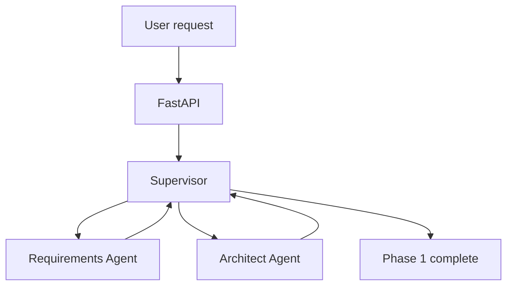

# Agent Techie

Agent Techie is a modular foundation for a multi-agent software engineering platform.
It accepts a repository task, turns it into structured requirements, proposes an
architecture, and keeps orchestration separate from future coding, testing, review,
and GitHub capabilities.

## Phase 1

Phase 1 provides:

- FastAPI application factory with `/health` and `POST /api/tasks`
- Pydantic settings loaded from environment variables
- Typed workflow state and validated requirements and architecture models
- LangGraph supervisor routing with explicit conditional edges
- Deterministic, network-free Requirements and Architect agents
- Pytest, Ruff, and MyPy project configuration

PostgreSQL, Redis, repository tools, live LLM providers, code modification, testing
loops, GitHub pull requests, checkpointing, and human approval are intentionally
reserved for later phases.

## Architecture



The workflow uses the current LangGraph `StateGraph` API with `START`, `END`, and
conditional routing. Agent output is validated with Pydantic before entering graph
state. Agent implementations expose a small callable boundary so a LangChain model
can be injected later without coupling provider code to orchestration.

## Local setup

Requires Python 3.11 or newer.

```bash
python -m venv .venv
source .venv/bin/activate
python -m pip install -e '.[dev]'
cp .env.example .env
```

Run the API:

```bash
uvicorn agent_techie.main:app --reload
```

Open the generated API documentation at `http://127.0.0.1:8000/docs`.

Example request:

```bash
curl -X POST http://127.0.0.1:8000/api/tasks \
	-H 'content-type: application/json' \
	-d '{"repository":"octo/demo","task":"Add JWT authentication to the API"}'
```

The endpoint returns `202 Accepted` with a run ID. Phase 1 executes the deterministic
workflow in a process-local background task; durable run storage and event streaming
are later-phase concerns.

## Quality checks

```bash
python -m pytest --cov=agent_techie --cov-report=term-missing
ruff check .
ruff format --check .
mypy src
```

## Security and future design

Secrets belong in environment variables and are excluded by `.gitignore`. Phase 2
will add allowlisted filesystem and terminal tools. Later GitHub operations will use
an abstract service boundary that can be backed by the GitHub API or MCP, create a
feature branch, and require human approval before pull request creation.
